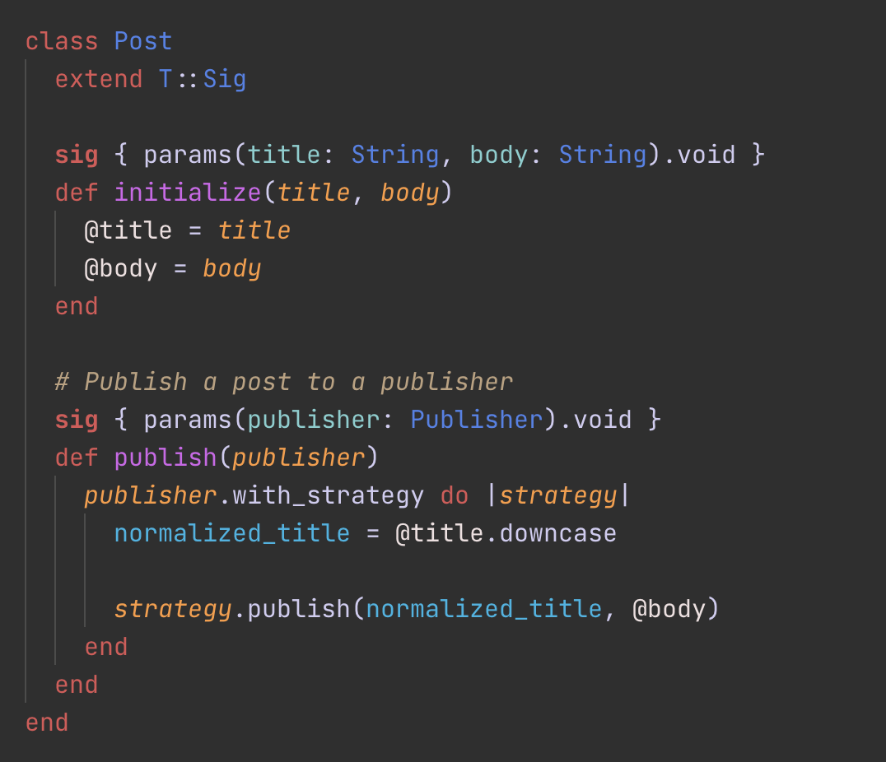

<p align="center">
  
</p>


# VS Code Shopify Ruby

This extension pack contains an opinionated collection of pre-configured extensions for Ruby development in VS Code:

- [Ruby LSP](https://marketplace.visualstudio.com/items?itemName=Shopify.ruby-lsp)
- [VSCode rdbg Ruby Debugger](https://marketplace.visualstudio.com/items?itemName=koichisasada.vscode-rdbg)

It also includes [Ruby Sorbet](https://marketplace.visualstudio.com/items?itemName=sorbet.sorbet-vscode-extension).
But it won't activate if your project doesn't use the [Sorbet type checker](https://sorbet.org/).

## Usage

Search for
[`Shopify.ruby-extensions-pack`](https://marketplace.visualstudio.com/items?itemName=Shopify.ruby-extensions-pack) in
the extensions tab and click install.

When activated, this extension will prompt you about overriding your existing configuration to use the recommended defaults.
You may want to backup your `settings.json` file before trying this extension out.

The recommended settings and their respective values can be found
in the extension [configuration file](https://github.com/Shopify/vscode-shopify-ruby/blob/main/src/configuration.ts#L10).

### Commands

The commands offered to help manage the recommended settings are:

```
"Ruby extensions pack: Force apply defaults" -> Apply all defaults
"Ruby extensions pack: Clear cache and recommended settings" -> Clear all cached choices and remove the recommended settings
```

### Themes

Included in this extension is the Spinel dark theme, which is made specifically for Ruby using all of the semantic
highlighting information provided by the [Ruby LSP](https://github.com/Shopify/ruby-lsp).

<p align="center">
  
</p>

## Contributing

Bug reports and pull requests are welcome on GitHub at https://github.com/Shopify/vscode-shopify-ruby.
This project is intended to be a safe, welcoming space for collaboration, and contributors
are expected to adhere to the
[Contributor Covenant](https://github.com/Shopify/vscode-shopify-ruby/blob/main/CODE_OF_CONDUCT.md)
code of conduct.

### Executing tests

1. Open VS Code on this repo
2. Make sure dependencies are installed (`yarn install`)
3. On VS Code's run and debug tab, select the `Extension tests` task
4. Click the run button or press F5 to run tests. Output is displayed in the debug console

### Testing the extension locally

1. Open VS Code on this repo
2. Make sure dependencies are installed (`yarn install`)
3. On VS Code's run and debug tab, select the `Extension` task
4. This will open a second VS Code window where the development version of the extension is running. Use it to verify
   that the extension is working as expected
5. If needed, the cache and recommended settings can be cleared by running the `Ruby extensions pack: Clear cache`
   command. This will make the extension prompt overrides again

### Debugging

To debug the extension, add breakpoints using the VS Code interface and either run the tests or the extension in
development mode.

## License

The extension is available as open source under the terms of the
[MIT License](https://github.com/Shopify/vscode-shopify-ruby/blob/main/LICENSE.txt).
